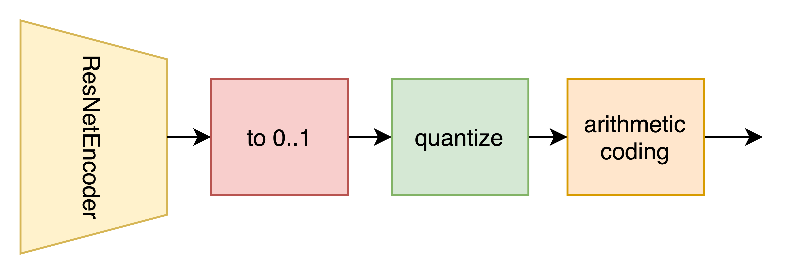
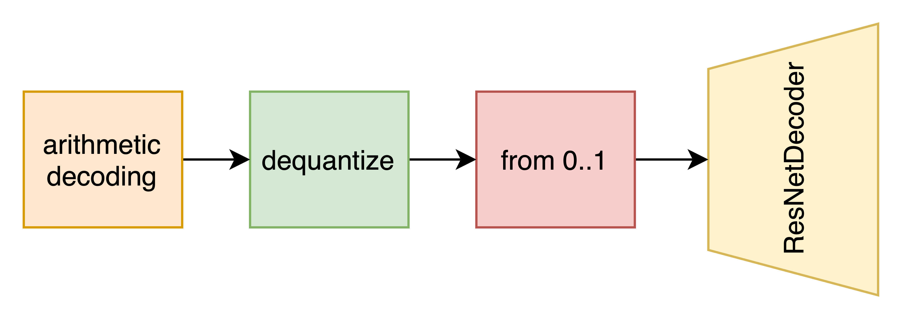

# Auto Encoder Representations Obtained to Build Image Codec (AEROBIC)




## Structure
* [`notebooks`](./notebooks) ‒ notebooks with experimets and analysis;
* [`samples`](./samples) ‒ compressed/decompressed examples;
* [`scripts`](./src) ‒ executable scripts to compress / decompress images;
* [`src`](./src) ‒ models, helpful functions;

## Requirements

```bash
pip install -r requirements.txt
```

## Usage

1. Download torch models weights of encoder and decoder:
   * For b = 2 quantization: [https://disk.yandex.ru/d/vwY_r5_ZFzKfBQ](https://disk.yandex.ru/d/vwY_r5_ZFzKfBQ)
   * For b = 8 quantization: [https://disk.yandex.ru/d/98hXtL3i6MINUw](https://disk.yandex.ru/d/98hXtL3i6MINUw)
2. To compress image run the script:
    ```shell
    python -m scripts.encoder \
        --weights weights/b8-3/encoder.pth \
        --b 8 \
        --image samples/b8-3/images/lena.png \
        --save-to samples/b8-3/compressed/lena.aerobic
    ```
   where
    * `weights` ‒ path to encoder torch weights
    * `b` ‒ quantization parameter (supported values: 2, 8)
    * `image` ‒ compressed image
    * `save-to` ‒ where to save compressed file
3. To decompress image run the script:
    ```shell
    python -m scripts.decoder \
        --weights weights/b8-3/decoder.pth \
        --b 8 \
        --file samples/b8-3/compressed/lena.aerobic \
        --save-to samples/b8-3/decompressed/lena.png
   ```
   where
   * `weights` ‒ path to decoder torch weights
   * `b` ‒ quantization parameter (supported values: 2, 8), the same as in encoder
   * `file` ‒ compressed file (.aerobic format)
   * `save-to` ‒ decompressed image